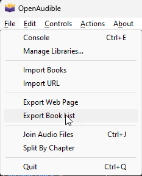
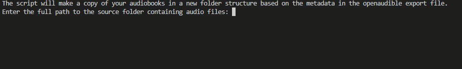

# OpenAudible Organizer

Organize your audiobook collection!

[](https://github.com/orbitalteapot/audiocollectionsorter/actions/workflows/docker-audiobooksort-latest.yml)
[](https://github.com/orbitalteapot/audiocollectionsorter/actions/workflows/docker-audiobooksort.yml)


This is a simple Python script that helps you organize your audio files into a structured directory format based on the metadata of the files. The script uses the `tinytag` library to read metadata from audio files, in addition to the OpenAudible export
## Using the program
### Download the Latest Release
It can be downloaded **[here](https://github.com/orbitalteapot/OpenAudible-FileOrganizer/releases)**.

### Export Booklist from OpenAudible

### Running the Program
Fill in the details promptet as ilustrated below:



The program will now quickly organize a copy of your books in the spesified folder.

## Directory Structure
If the audio is part of a `series`:

```mathematica
Author
└── Series
    └── Book <int>
        └── Title
```


If the audio is not part of a series it will use the `album`:

```mathematica
Author
└── Album
    └── Title
```

If the book have no `album`:
```mathematica
Author
└── Title
```

## Typical Output Example For AudioBooks
```mathematica
J.K. Rowling (Artist)
└── Wizarding World (series)
    └── Book 1
        └── Harry Potter and the Sorcerer's Stone.mp3
```


## Running the Python Script

### 1. Clone the repository or download the script.

### 2. Install the required Python library by running:

```sh
cd audiocollectionsorter
python3 -m venv .
source ./bin/activate
pip install -r requirements.txt
```

### 3. Run the script according to your needs by executing:
```sh
python3 scripts/organize_audiobook.py
```
You will be prompted to enter requiered information

### 4. Deactivate Environment
```sh
deactivate
```

## Usage With docker
### 1. Clone the repository or download the script.
### 2. Build the Docker Image for sorting audio or audiobooks
```sh
cd audiocollectionsorter
docker build -t audiobookcollectionsorter -f AudioBookSort_Dockerfile .
```

### 3. Run the Container
Run the following command to start a container from the image. Replace /path/to/source with the path to your audio files, and /path/to/destination with the path where you want the organized audio to be stored:
```sh
docker run -it --rm -v /mnt/d/AudioBooks/books/:/source -v /mnt/d/sortedaudiobooks:/destination -v /mnt/d/mybooklist/:/csvexport audiobookcollectionsorter
```

### 4. The container will organize the audio files based on their metadata.

## Create the executables for windows
You can run the following commands
```sh
cd audiocollectionsorter
python3 -m venv myenv
./Script/activate
pip install -r requirements.txt
pyinstaller .\scripts\organize_audiobook.py --onefile
deactivate
```
This will produce `organize_audiobook.exe` and can be used as normal. If you don't want to do this i will make the files available under release.

## Alternativly you can pull the images from DockerHub
```sh
docker pull orbitalteapot/audiobookcollectionsorter
```