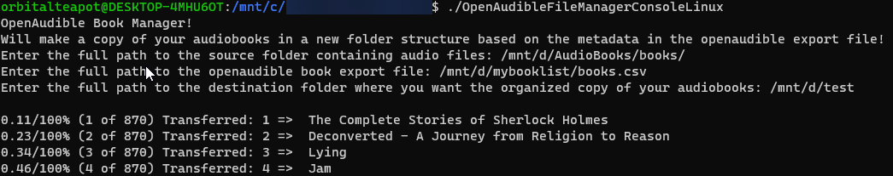

# OpenAudible Book Manager

Organize your audiobook collection!

This is a simple C# program that helps organize your audiobook collection into a structured directory format based on the OpenAudible book list export.
## Getting started
### Download the Latest Release **[here](https://github.com/orbitalteapot/OpenAudible-FileOrganizer/releases)**.
### Export Book list from OpenAudible

### Run the console program



The program will now quickly organize a copy of your books in the specified folder.

## Directory Structure
```mathematica
J.K. Rowling (Artist)
└── Wizarding World (series)
    └── Book 1
        └── Harry Potter and the Sorcerer's Stone.mp3
```


## Run the service program in docker
It will monitor the export file and automatically start transferring the new files if it is changed (new export)
```sh
docker run --rm -d -v <folderwithbooklist>:/app/export -v <books>:/app/source -v <destination>:/app/destination orbitalteapot/openaudiblebookmanagerservice:latest
```

## Run the console program in docker
Enter the /app/* path for all three inputs
```sh
docker run --rm -it -v <folderwithbooklist>:/app/export -v <books>:/app/source -v <destination>:/app/destination orbitalteapot/openaudiblebookmanagerconsole:latest
```

## Build your own docker image
### 1. Clone the repository
```sh
git clone https://github.com/orbitalteapot/OpenAudible-FileOrganizer.git
cd OpenAudible-FileOrganizer
```
### 2. Build the Docker Images
```sh
docker compose build
```
