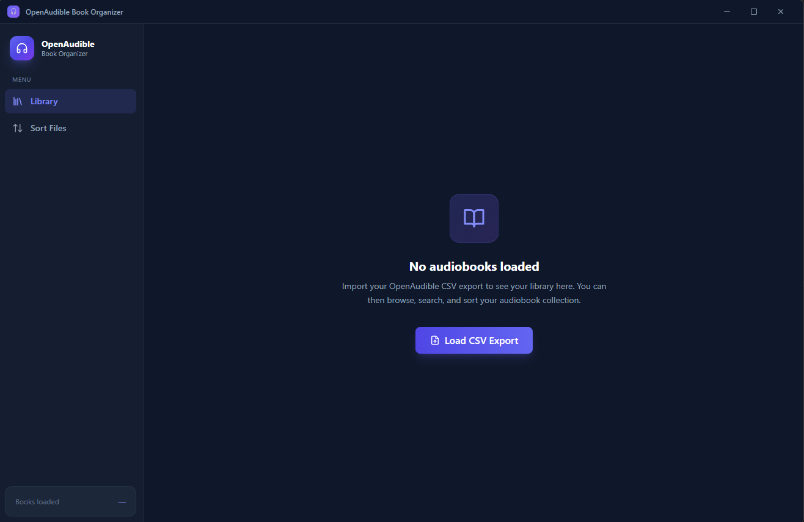
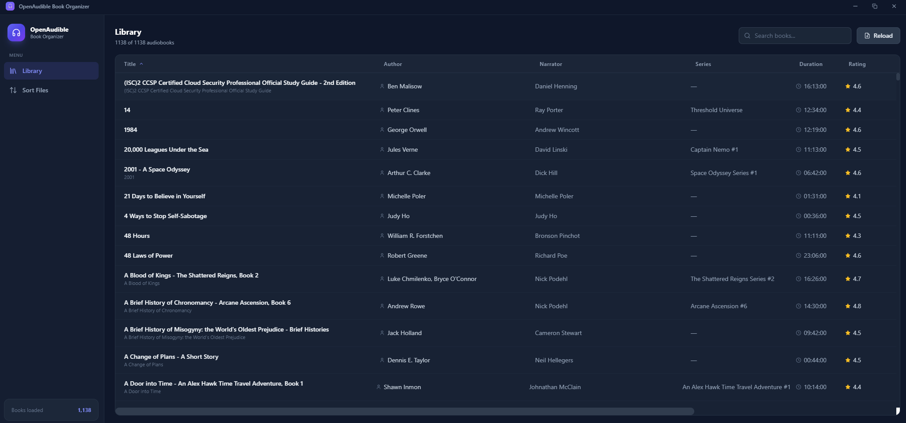
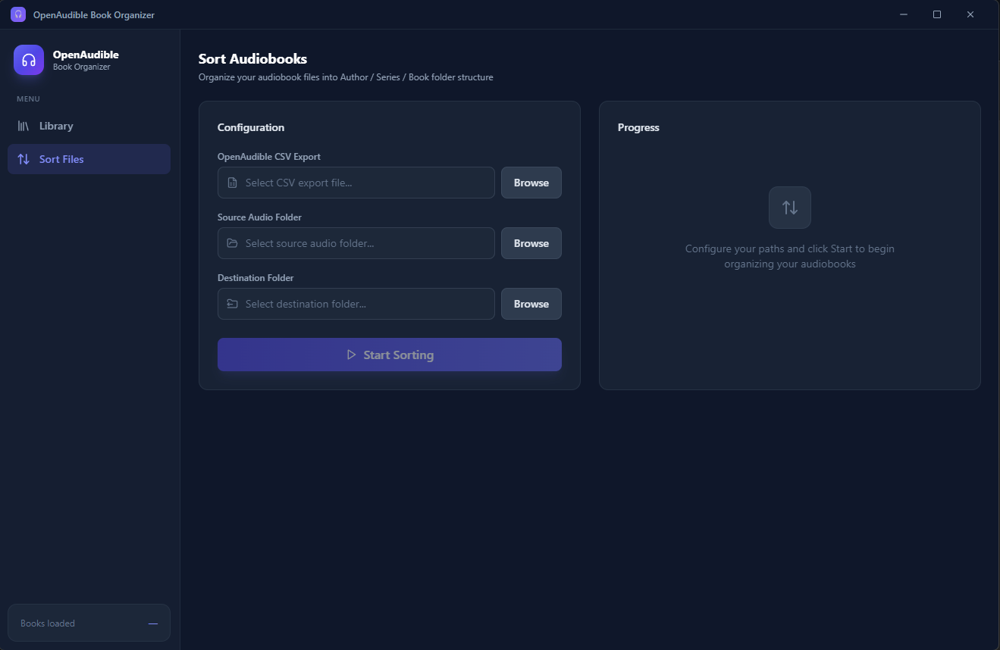
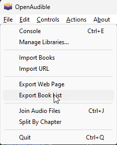
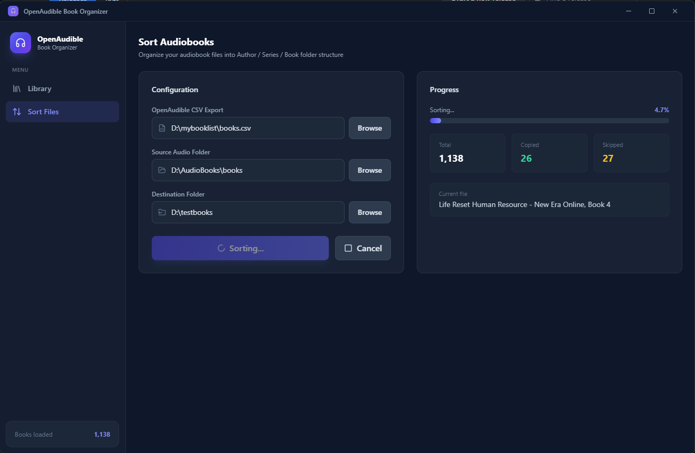

# OpenAudible Book Organizer

Organize your audiobook collection with a modern desktop app.

OpenAudible Book Organizer is a cross-platform Electron application with a C# backend that helps organize your audiobook collection into a structured directory format based on the OpenAudible book list export.

Supported targets include Windows, Linux, macOS, and Docker.

## What It Does

- Loads an OpenAudible CSV export
- Organizes audiobook files into `Author / Series / Book` folders
- Copies companion PDFs when they are available in the CSV metadata
- Ships as a desktop app and as a Docker image for watcher-based automation

## Screenshots

### Library View
Browse, search, and sort your entire audiobook collection.



### Library with Books Loaded
See your imported library populated and ready to browse, filter, and manage.



### File Sorter
Configure source and destination paths, then sort your audiobooks into organized folders with real-time progress tracking.



### Export Book List from OpenAudible
Export your OpenAudible library, then use that export to organize your books automatically.



### Start Sorting
Select your OpenAudible export file, choose your source and destination directories, and let the app handle the rest. Your audiobooks will be neatly organized into folders by author and series.



## Desktop App

### Prerequisites

- [.NET 10 SDK](https://dotnet.microsoft.com/download/dotnet/10.0)
- [Node.js](https://nodejs.org/) (v18+)

### Run in Development Mode

```sh
# Start the C# API backend
dotnet run --project ManagerApi

# In a separate terminal, start the Electron app
cd electron-ui
npm install
npm run dev
```

### Build Installers

```sh
cd electron-ui

# Windows (NSIS installer)
npm run dist:win

# Linux (AppImage + deb)
npm run dist:linux

# macOS x64 (dmg)
npm run dist:mac-x64

# macOS Apple Silicon (dmg)
npm run dist:mac-arm
```

Installers are output to `electron-ui/release/`.

## Docker Image

The watcher service is published to GitHub Container Registry under GitHub Packages as:

```text
ghcr.io/orbitalteapot/openaudible-book-organizer
```

Available tags are published by the release workflow:

- Exact release version, for example `1.2.3`
- Major/minor version, for example `1.2`
- `latest`

### Pull the Image

```sh
docker pull ghcr.io/orbitalteapot/openaudible-book-organizer:latest
```

If the package is private, log in first:

```sh
echo <GITHUB_TOKEN> | docker login ghcr.io -u <GITHUB_USERNAME> --password-stdin
```

The token needs `read:packages` permission.

### How the Docker Image Works

The Docker image runs the `WatcherService`, which continuously watches your source folder for audiobook files and organizes them into your destination folder using the metadata from your OpenAudible CSV export.

At startup and while running, it uses:

- `CSV_PATH` to load book metadata from your OpenAudible export
- `SOURCE_PATH` as the folder to watch for audiobook files
- `DESTINATION_PATH` as the folder where organized books are written

The watcher matches files against the CSV metadata and then sorts them into an output structure like:

```text
Author/
  Series/
    Book 1/
      Book Title.m4b
      Book Title.pdf
```

If a companion PDF is present in the CSV metadata and available in the source data, it is copied alongside the audiobook.

### Run the Watcher Container

Mount three directories:

- A folder containing your OpenAudible CSV export
- Your source audiobook folder
- Your destination folder for organized books

The container expects these environment variables:

- `CSV_PATH=/data/books.csv`
- `SOURCE_PATH=/source`
- `DESTINATION_PATH=/destination`

Example:

```sh
docker run -d \
  --name openaudible-book-watcher \
  -e CSV_PATH=/data/books.csv \
  -e SOURCE_PATH=/source \
  -e DESTINATION_PATH=/destination \
  -v /path/to/local/data:/data \
  -v /path/to/local/audiobooks:/source \
  -v /path/to/local/organized:/destination \
  --restart unless-stopped \
  ghcr.io/orbitalteapot/openaudible-book-organizer:latest
```

### What to Do After the Container Starts

Once the container is running, the normal flow is:

1. Export your library from OpenAudible to a CSV file.
2. Put that CSV file at the mounted path expected by the container, usually `./data/books.csv`.
3. Make sure your audiobook files exist in the mounted source folder.
4. Let the watcher detect files and copy them into the mounted destination folder.

In practice, that means:

- new files placed in the source folder should be sorted automatically
- existing files in the source folder can also be processed, depending on what the watcher sees when it starts
- organized output will appear in your destination folder on the host machine

### Verifying That It Is Working

After startup, you should verify three things:

1. The container is running:

```sh
docker ps
```

2. The logs show the configured paths and watcher activity:

```sh
docker logs -f openaudible-book-watcher
```

3. Books begin appearing in your destination folder in organized author/series/book folders.

Typical things to look for in the logs:

- the CSV file path was found correctly
- the source and destination paths are what you expected
- the CSV was loaded successfully
- files are being detected and sorted

### Updating the CSV

If you export a new CSV from OpenAudible, replace the existing `books.csv` file in your mounted data folder and restart the container so it reloads the metadata:

```sh
docker restart openaudible-book-watcher
```

### Stopping or Restarting the Watcher

Use these commands for normal management:

```sh
docker stop openaudible-book-watcher
docker start openaudible-book-watcher
docker restart openaudible-book-watcher
```

### Common Setup Issues

- If nothing is being sorted, check that `books.csv` exists and matches the mounted `CSV_PATH`.
- If the container runs but no files appear in the destination folder, verify that your host folder mounts are correct.
- If the package cannot be pulled, confirm that the package exists under GitHub Packages and that your GHCR login has access.
- If files are present but not being matched, export a fresh CSV from OpenAudible and restart the container.

### Use docker-compose.yml

This repository already includes a sample [docker-compose.yml](d:/Development/test/newtest/OpenAudible-BookOrganizer/docker-compose.yml).

1. Put your OpenAudible CSV export in `./data/books.csv`.
2. Replace the example source and destination mount paths with your real folders.
3. If you want to use the published package instead of building locally, change the service from `build:` to `image:`.

Example service using the published image:

```yaml
services:
  book-watcher:
    image: ghcr.io/orbitalteapot/openaudible-book-organizer:latest
    environment:
      CSV_PATH: /data/books.csv
      SOURCE_PATH: /source
      DESTINATION_PATH: /destination
    volumes:
      - ./data:/data
      - /path/to/your/audiobooks:/source
      - /path/to/your/organized:/destination
    restart: unless-stopped
```

Then start it with:

```sh
docker compose up -d
```

### Where to Find It on GitHub

The Docker image is published to GitHub Packages, not attached to the GitHub Release assets.

- Repo owner packages page: `https://github.com/users/orbitalteapot/packages`
- Package URL: `https://github.com/users/orbitalteapot/packages/container/package/openaudible-book-organizer`

Depending on GitHub package visibility and linkage, it may appear under the owner Packages page before it appears in the repository sidebar.

## Directory Structure

Books are organized into the following folder structure:

```text
J.K. Rowling (Author)
\-- Wizarding World (Series)
    +-- Book 1
        \-- Harry Potter and the Sorcerer's Stone.mp3
```

## Project Structure

| Folder | Description |
|---|---|
| `AudioFileSorter/` | Shared C# library for CSV parsing and file sorting logic |
| `ManagerApi/` | ASP.NET Core Web API backend |
| `electron-ui/` | Electron + React + Tailwind frontend |
