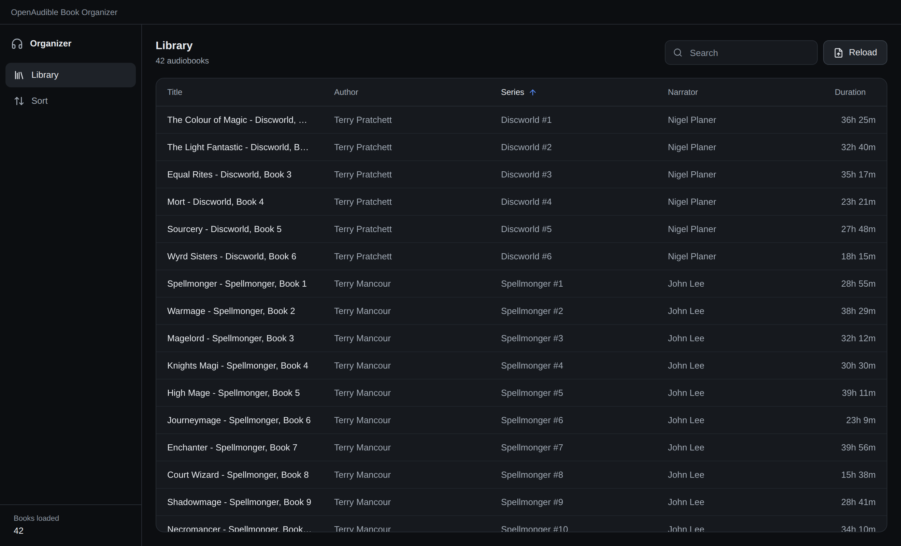
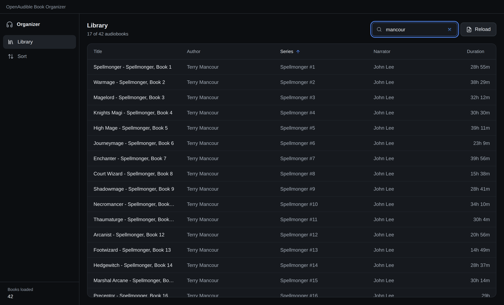
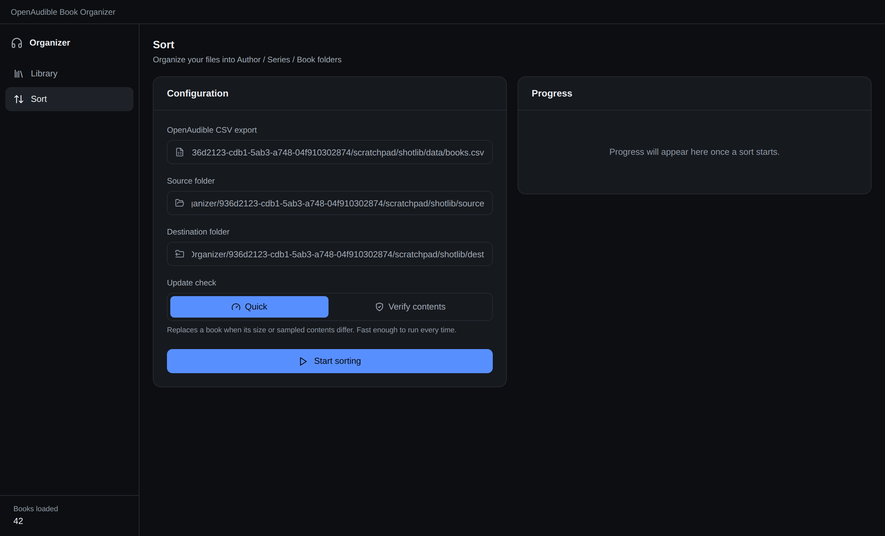
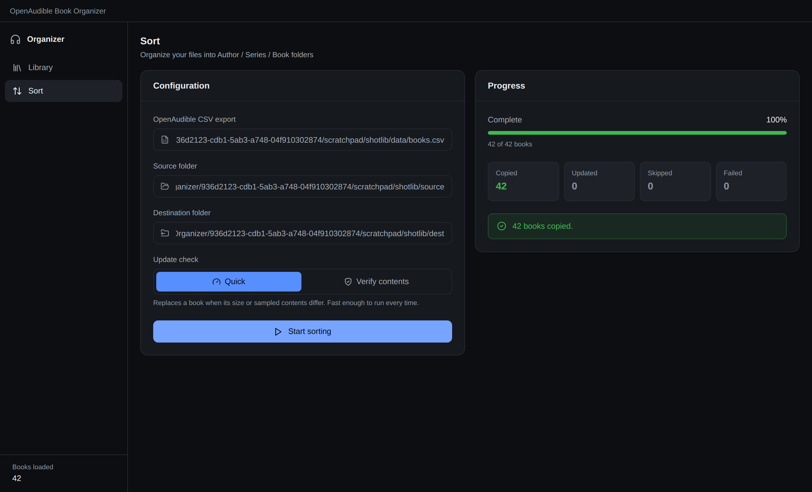

# OpenAudible Book Organizer

Turn a folder full of downloaded audiobooks into a library you can navigate.

OpenAudible gives you your books, but it leaves them as a flat pile of files with names like
`B08XYZ123.m4b`. This app reads the CSV export from OpenAudible and copies each book into an
`Author / Series / Book` folder structure, keeping the originals untouched.

It runs as a desktop app on **Windows, macOS and Linux**, and as a **Docker** container with a
browser interface for a NAS or home server.



## What it does

- Reads an OpenAudible CSV export and shows your library, searchable and sortable
- Copies each book into `Author / Series / Book` folders
- Brings companion PDFs along with the audiobook
- Replaces books you have re-downloaded, so an organised library stays current
- Never moves or deletes anything in your source folder — it only ever copies out of it

---

# Using the desktop app

## 1. Install

Download the file for your platform from the
[latest release](https://github.com/orbitalteapot/OpenAudible-BookOrganizer/releases). Nothing else
is required — the app bundles everything it needs, so you do **not** need .NET or Node installed.

| Platform | File | How to install |
| --- | --- | --- |
| Windows | `...-windows-x64.exe` | Run the installer. |
| macOS (Apple Silicon) | `...-macos-arm64.dmg` | Open the disk image, drag the app to Applications. |
| macOS (Intel) | `...-macos-x64.dmg` | Open the disk image, drag the app to Applications. |
| Linux | `...-linux-x86_64.AppImage` | `chmod +x` the file, then run it. |
| Linux (Debian/Ubuntu) | `...-linux-amd64.deb` | `sudo apt install ./<file>.deb` |

### These builds are not code-signed

Signing certificates cost money per platform, so the releases are unsigned. Your operating system
will say so, in language that sounds more alarming than the situation warrants. This is what you
will see and what to do about it:

**Windows** shows *"Windows protected your PC"*. Click **More info**, then **Run anyway**.

**macOS** refuses to open the app, saying Apple cannot check it for malicious software. Either
right-click the app in Applications and choose **Open** (which offers an Open button the normal
double-click does not), or clear the quarantine flag from a terminal:

```sh
xattr -dr com.apple.quarantine "/Applications/OpenAudible Book Organizer.app"
```

**Linux** has no such prompt. For the AppImage, just make it executable:

```sh
chmod +x OpenAudible-Book-Organizer-*-linux-x86_64.AppImage
./OpenAudible-Book-Organizer-*-linux-x86_64.AppImage
```

If you would rather not run unsigned binaries, [build from source](#building-from-source) — it is
two commands.

## 2. Export your library from OpenAudible

In OpenAudible, export your book list to CSV. This file is what tells the organiser which file is
which book.


Re-export whenever you buy or download more books, then reload it in the app.

## 3. Load your library

Open the app, stay on the **Library** page and click **Load CSV export**. Pick the CSV you just
exported.

Your books appear in a table you can search and sort. Click any column heading to sort by it;
click again to reverse it. Sorting by **Series** orders books within each series by their number,
so a series reads in order rather than alphabetically.



Loading the CSV only reads it. Nothing is copied until you say so.

## 4. Sort your books

Go to the **Sort** page and fill in three paths:

| Field | What to choose |
| --- | --- |
| **OpenAudible CSV export** | The CSV file from step 2. |
| **Source folder** | Where OpenAudible put your downloaded books. |
| **Destination folder** | Where you want the organised library. Must not be inside the source folder. |



Then click **Start sorting**. Progress appears on the right as it works, and you can cancel at any
point — books already copied are complete files, and re-running picks up where you left off.



When it finishes you get four numbers:

| Counter | Meaning |
| --- | --- |
| **Copied** | Books written to the destination, whether new or replaced. |
| **Updated** | Of those, the ones that replaced an out-of-date copy. |
| **Skipped** | Already up to date, or no matching file found in the source folder. |
| **Failed** | Could not be processed. Details are in the backend log. |

Running a sort again after adding books is cheap: everything already in place is skipped.

## Keeping books up to date

Publishers re-issue audiobooks — a corrected chapter, a re-recorded narration, a new edition. When
you download the new version, a sort should replace the copy in your organised library rather than
leave the old one sitting there.

Every run compares each book against the copy at the destination and only writes when they differ.
How closely it compares is up to you, using the **Update check** setting on the Sort page:

| Update check | What it compares | When to use it |
| --- | --- | --- |
| **Quick** (default) | File size, plus the first, middle and last 4 KB | Every day. It catches any re-release whose length changed, which is nearly all of them, and costs almost nothing over a large library. |
| **Verify contents** | Every byte of both files | When you suspect a book was re-issued at exactly the same size, or you want certainty after a bad disk or an interrupted copy. Slower: it reads both files in full. |

Two things worth knowing about re-releases:

- **Nothing is ever deleted from your destination folder.** If a re-release changes a book's title
  enough to be filed under a different name, the new file is written alongside the old one and
  removing the old copy is up to you. A title differing only in punctuation or spacing still
  resolves to the existing file and is replaced in place.
- **Replacing a book is atomic.** The new version is written beside the old one and renamed over
  it, so an interrupted update leaves you with either the old copy or the new one, never half of
  each.

## How your books get organised

```text
Terry Mancour/
  Spellmonger/
    Book 1/
      Spellmonger.m4b
      Spellmonger.pdf
    Book 2/
      Warmage.m4b
Andy Weir/
  Project Hail Mary.m4b
```

A book with no series goes directly in the author's folder. A companion PDF is copied next to its
audiobook when the export mentions one and the file is present.

Names come from your metadata, cleaned up so the result is portable:

- Characters that are illegal in Windows file names (`: ? * " < > | \ /`) are removed on every
  platform, so the library can be moved to a NAS or an external drive without breaking.
- Very long names are shortened to 200 characters.
- Two spellings of the same author (`J.K. Rowling` and `JK Rowling`) resolve to one folder, and an
  existing folder that means the same thing is reused rather than duplicated.
- If two different books would end up with the same file name, the second gets a `(2)` suffix
  instead of overwriting the first.

## If something goes wrong

| Symptom | Likely cause |
| --- | --- |
| Books show as **Skipped** and nothing is copied | The source folder does not contain the files named in the CSV. Check the source path, and re-export the CSV if you have moved files since. |
| The app window opens but stays empty | Port `5123` is in use by something else. The app runs its backend there. Close the other program and restart the app. |
| "Sort already in progress" | A run is still going. Wait for it, or cancel it. |
| Some books land under **Unknown** | Those rows have no author in the CSV. Fix them in OpenAudible and re-export. |
| A row is missing from the library | The CSV row could not be read. The app reports how many rows it skipped when loading. |

---

# Docker (web app)

The container runs the same organiser with a browser interface instead of a desktop window, which
suits a NAS or home server. Unlike the desktop app, its paths are fixed by the container's
environment rather than chosen in the browser — the web page is a control panel for the container.

## The image

```text
ghcr.io/orbitalteapot/openaudible-bookorganizer
```

Note there is **no hyphen** between "book" and "organizer" in the image name.

```sh
docker pull ghcr.io/orbitalteapot/openaudible-bookorganizer:latest
```

Tags published by the release workflow:

| Tag | Points at |
| --- | --- |
| `latest` | The most recent stable release. |
| `3.1` | The most recent `3.1.x` stable release. |
| `3.1.0` | That exact release, forever. |
| `3.1.0-beta.1` | A pre-release, under its exact version **only**. |

A pre-release never becomes `latest` or the major/minor tag, so pulling `latest` cannot land you on
a beta by accident — you have to ask for it by name.

## Run it

You need three directories on the host: one holding your CSV export, your source audiobooks, and
the destination for the organised library.

```sh
docker run -d \
  --name openaudible-bookorganizer \
  -e CSV_PATH=/data/books.csv \
  -e SOURCE_PATH=/source \
  -e DESTINATION_PATH=/destination \
  -p 5123:5123 \
  -v ./data:/data \
  -v /path/to/your/audiobooks:/source \
  -v /path/to/your/organized:/destination \
  --restart unless-stopped \
  ghcr.io/orbitalteapot/openaudible-bookorganizer:latest
```

Or with the [docker-compose.yml](docker-compose.yml) in this repository:

```yaml
services:
  book-organizer-web:
    image: ghcr.io/orbitalteapot/openaudible-bookorganizer:latest
    environment:
      CSV_PATH: /data/books.csv
      SOURCE_PATH: /source
      DESTINATION_PATH: /destination
    ports:
      - "5123:5123"
    volumes:
      - ./data:/data
      - /path/to/your/audiobooks:/source
      - /path/to/your/organized:/destination
    restart: unless-stopped
```

```sh
docker compose up -d
```

Then open <http://localhost:5123>, load the library, and start a sort — the same two pages as the
desktop app, minus the file pickers.

## Configuration

| Variable | Required | Default | Purpose |
| --- | --- | --- | --- |
| `CSV_PATH` | yes | — | The OpenAudible CSV export, inside the container. |
| `SOURCE_PATH` | yes | — | Mounted folder holding your downloaded audiobooks. |
| `DESTINATION_PATH` | yes | — | Mounted folder to write the organised library into. |
| `COMPARISON_MODE` | no | `quick` | Default update check: `quick` or `full`. The Sort page can override it per run. |
| `OABO_MAX_PARALLELISM` | no | cores ÷ 4, max 8 | How many books are copied at once. Set `1` or `2` for a network share or a spinning disk, where more concurrency is slower, not faster. |
| `ASPNETCORE_URLS` | no | `http://0.0.0.0:5123` | Change the port the container listens on. |

## Updating your library

Replace `books.csv` in the mounted data folder with a fresh export, reload the library in the
browser, then start a sort.

## Checking it works

```sh
docker ps                                    # container is running
curl http://localhost:5123/api/health        # {"status":"ok"}
docker logs -f openaudible-bookorganizer     # startup, configured paths, sort results
```

The log lines at startup show which paths the container resolved, which is the quickest way to
spot a mount that is not where you thought it was.

## Docker troubleshooting

| Symptom | Likely cause |
| --- | --- |
| Page does not load | Port `5123` is not published, or is taken on the host. |
| "CSV file not found" | `CSV_PATH` does not match where the file is mounted. |
| Everything is skipped | `SOURCE_PATH` is mounted somewhere other than where the books are. |
| "The destination folder cannot be the source folder or live inside it" | Copying a folder into itself never terminates cleanly, so it is refused. Mount them separately. |
| `docker pull` fails | Check the image name has no hyphen between "book" and "organizer", and that you are logged in to GHCR if the package is private. |

The image is published to GitHub Packages, not attached to release assets:
`https://github.com/users/orbitalteapot/packages/container/package/openaudible-bookorganizer`

---

# Building from source

### Prerequisites

- [.NET 10 SDK](https://dotnet.microsoft.com/download/dotnet/10.0)
- [Node.js](https://nodejs.org/) 20 or newer

### Run in development

```sh
# Terminal 1 — the C# backend
dotnet run --project ManagerApi

# Terminal 2 — the Electron app
cd electron-ui
npm install
npm run dev
```

### Run the tests

```sh
dotnet test OpenAudibleBookManager.sln     # sorting engine
npm --prefix electron-ui test              # library search and ordering
```

The backend suite covers path sanitisation, author and series folder resolution, planning
determinism, atomic and repeatable copying, both update checks, cancellation and CSV import
robustness. The frontend suite covers searching, and the ordering rules behind each column.

### Build installers

```sh
cd electron-ui
npm run dist:win        # Windows NSIS installer
npm run dist:linux      # Linux AppImage + deb
npm run dist:mac-x64    # macOS Intel dmg
npm run dist:mac-arm    # macOS Apple Silicon dmg
```

Output lands in `electron-ui/release/`. Each build publishes the backend as a self-contained
binary first, which is why the installers are large and why users need no runtime installed.

### How it fits together

| Project | Role |
| --- | --- |
| `AudioFileSorter` | The organiser: reads the CSV, decides where every book goes, copies it there. |
| `ManagerApi` | ASP.NET Core host exposing that over HTTP, and serving the web UI in Docker. |
| `electron-ui` | React interface, running either in an Electron window or in a browser. |

The desktop app is the same web interface in an Electron window, with the backend started as a
child process on port 5123 and native file pickers wired in.
