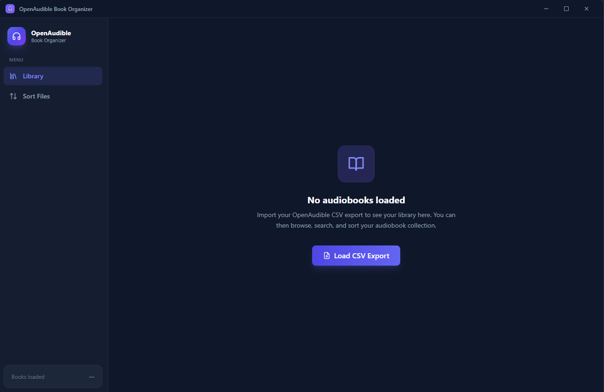
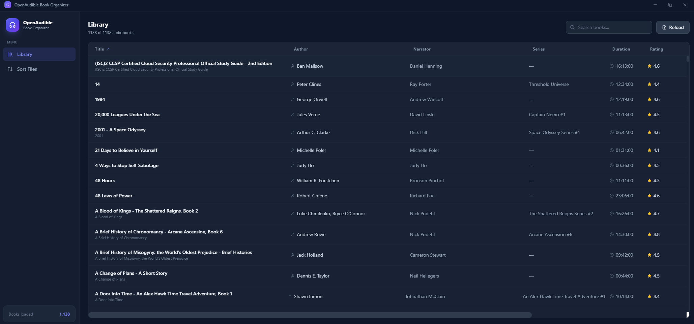
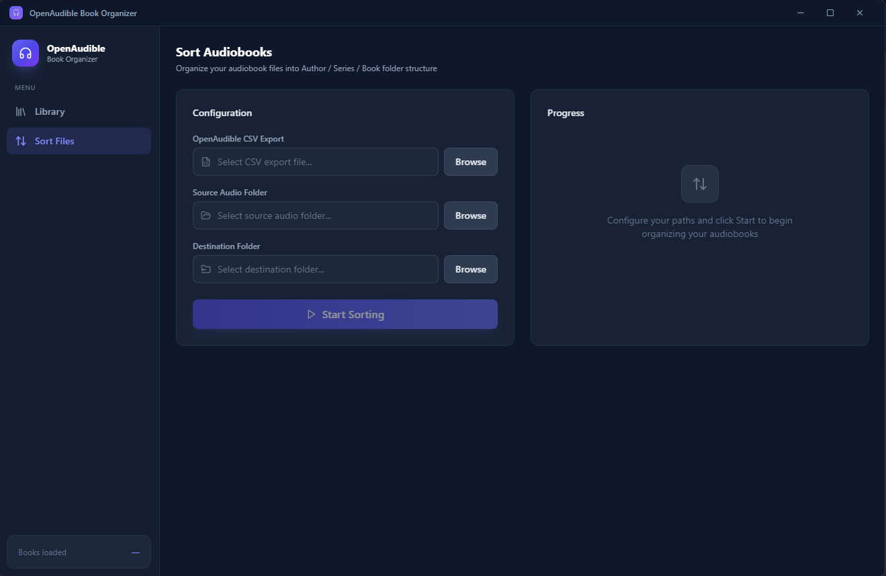
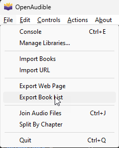
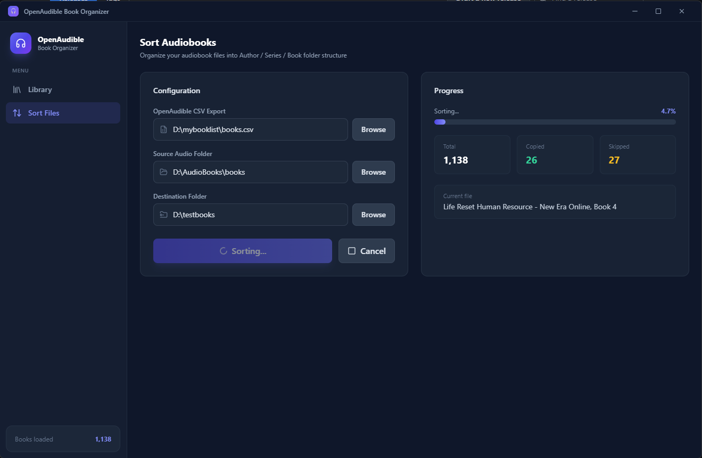

# OpenAudible Book Organizer

Organize your audiobook collection with a modern desktop app.

OpenAudible Book Organizer is a cross-platform Electron application with a C# backend that helps organize your audiobook collection into a structured directory format based on the OpenAudible book list export.

Supported targets include Windows, Linux, macOS, and Docker.

## What It Does

- Loads an OpenAudible CSV export
- Organizes audiobook files into `Author / Series / Book` folders
- Copies companion PDFs when they are available in the CSV metadata
- Replaces books you have re-downloaded, so an organized library stays current
- Ships as a desktop app and as a Docker image for watcher-based automation

## Keeping Books Up To Date

Publishers re-issue audiobooks: a corrected chapter, a re-recorded narration, an updated edition.
When you download the new version, a sort should replace the copy already in your organized
library rather than leave the old one sitting there.

Every run compares each book against the copy at the destination and only writes when they differ,
so re-running a sort is cheap and safe. How closely it compares is up to you — the **Update check**
setting on the Sort page toggles between the two:

| Update check | What it compares | When to use it |
| --- | --- | --- |
| **Quick** (default) | File size, plus the first, middle and last 4 KB | Every day. It catches any re-release whose length changed, which is nearly all of them, and costs almost nothing to run over a large library. |
| **Verify contents** | Every byte of both files | When you suspect a book was re-issued at exactly the same size, or you want certainty after a bad disk or an interrupted copy. Slower: it reads both files in full. |

Either way, a book that already matches is left untouched. The sort summary counts it as
**Skipped**, along with any book whose source file could not be found at all, and reports
**Updated** — books replaced because their source had changed — as a subset of **Copied**, which
also includes books written to the destination for the first time.

In Docker, set the default with the `COMPARISON_MODE` environment variable (`quick` or `full`);
the Sort page can still override it for an individual run.

Two things worth knowing about re-releases:

- The organiser never deletes from your destination folder. If a re-release also changes the book's
  title enough to be filed under a different name, the new file is written alongside the old one,
  and removing the old copy is up to you. A title that differs only in punctuation or spacing still
  resolves to the existing file, which is replaced in place as usual.
- Replacing a book is atomic: the new version is written beside the old one and renamed over it, so
  an interrupted update leaves you with either the old copy or the new one, never half of each.

## Screenshots

### Library View
Browse, search, and sort your entire audiobook collection.



### Library with Books Loaded
See your imported library populated and ready to browse, filter, and manage.



### File Sorter
Configure source and destination paths, then sort your audiobooks into organized folders with real-time progress tracking.



### Export Book List from OpenAudible
Export your OpenAudible library, then use that export to organize your books automatically.



### Start Sorting
Select your OpenAudible export file, choose your source and destination directories, and let the app handle the rest. Your audiobooks will be neatly organized into folders by author and series.



## Desktop App

### Prerequisites

- [.NET 10 SDK](https://dotnet.microsoft.com/download/dotnet/10.0)
- [Node.js](https://nodejs.org/) (v18+)

### Run in Development Mode

```sh
# Start the C# API backend
dotnet run --project ManagerApi

# In a separate terminal, start the Electron app
cd electron-ui
npm install
npm run dev
```

### Run the Tests

The sorting engine is covered by a test suite that runs on Linux, macOS, and Windows:

```sh
dotnet test OpenAudibleBookManager.sln
```

It exercises path sanitisation, author and series folder resolution, planning determinism,
atomic and repeatable copying, cancellation, and CSV import robustness.

### Build Installers

```sh
cd electron-ui

# Windows (NSIS installer)
npm run dist:win

# Linux (AppImage + deb)
npm run dist:linux

# macOS x64 (dmg)
npm run dist:mac-x64

# macOS Apple Silicon (dmg)
npm run dist:mac-arm
```

Installers are output to `electron-ui/release/`.

## Docker Image

The web app container is published to GitHub Container Registry under GitHub Packages as:

```text
ghcr.io/orbitalteapot/openaudible-bookorganizer
```

Note that the image name has no hyphen between "book" and "organizer".

Available tags are published by the release workflow:

- Exact release version, for example `1.2.3`
- Major/minor version, for example `1.2`
- `latest`

A pre-release such as `3.1.0-beta.1` is published under its exact version only. `latest` and the
major/minor tag keep pointing at the most recent stable release, so pulling `latest` never lands
you on a beta by accident — you have to ask for the version by name.

### Pull the Image

```sh
docker pull ghcr.io/orbitalteapot/openaudible-bookorganizer:latest
```

### How the Docker Image Works

The Docker image runs the ASP.NET Core `ManagerApi` together with the built frontend, so the container exposes a browser-based interface instead of an automatic watcher process.

At startup and while running, it uses:

- `CSV_PATH` to load book metadata from your OpenAudible export
- `SOURCE_PATH` as the mounted source folder that contains your audiobook files
- `DESTINATION_PATH` as the folder where organized books are written

Optional:

- `OABO_MAX_PARALLELISM` sets how many books are copied at once. It defaults to a quarter of the
  available CPU cores, capped at 8. Lower it to `1` or `2` if the destination is a network share
  or a spinning disk, where more concurrency makes transfers slower rather than faster.
- `COMPARISON_MODE` sets the default update check, `quick` (the default) or `full`. See
  [Keeping books up to date](#keeping-books-up-to-date). The Sort page can override it per run.

### How the Website Works

When the container is running, it serves a website on port `5123`.

That website has two main jobs:

- `Library` page: loads and displays the books from the CSV file configured inside the container
- `Sort` page: starts a sort run using the container's fixed `CSV_PATH`, `SOURCE_PATH`, and `DESTINATION_PATH`

In the Docker version, those paths are not chosen in the browser. They are supplied by the container environment and mounts, which means the website is acting as a control panel for the container rather than a file-picker UI.

The normal website flow is:

1. Start the container.
2. Open `http://localhost:5123`.
3. Go to the `Library` page and load the configured CSV.
4. Review your books in the browser.
5. Go to the `Sort` page and click `Start Sorting`.
6. Watch progress in the website while files are copied into the destination folder.

The web UI lets you:

- load the configured CSV into the library view
- browse the books in your OpenAudible export
- manually trigger a sort operation
- monitor progress in the browser while files are copied

The sort process matches files against the CSV metadata and then writes them into an output structure like:

```text
Author/
  Series/
    Book 1/
      Book Title.m4b
      Book Title.pdf
```

If a companion PDF is present in the CSV metadata and available in the source data, it is copied alongside the audiobook.

### Run the Web App Container

Mount three directories:

- A local `./data` folder containing your OpenAudible CSV export as `books.csv`
- Your source audiobook folder
- Your destination folder for organized books

The container expects these environment variables:

- `CSV_PATH=/data/books.csv`
- `SOURCE_PATH=/source`
- `DESTINATION_PATH=/destination`
- `COMPARISON_MODE=quick` (optional; use `full` to compare every byte)

Example:

```sh
docker run -d \
  --name openaudible-book-organizer \
  -e CSV_PATH=/data/books.csv \
  -e SOURCE_PATH=/source \
  -e DESTINATION_PATH=/destination \
  -p 5123:5123 \
  -v ./data:/data \
  -v /path/to/local/audiobooks:/source \
  -v /path/to/local/organized:/destination \
  --restart unless-stopped \
  ghcr.io/orbitalteapot/openaudible-bookorganizer:latest
```

### What to Do After the Container Starts

Once the container is running, the normal flow is:

1. Export your library from OpenAudible to a CSV file.
2. Put that CSV file at the mounted path expected by the container, usually `./data/books.csv`.
3. Make sure your audiobook files exist in the mounted source folder.
4. Open `http://localhost:5123` in your browser.
5. Load the library from the configured CSV path.
6. Trigger sorting from the Sort page in the web UI.

You can think of the website as the front door to the container:

- Docker mounts provide the files and folders
- the API inside the container reads those paths
- the browser UI tells the API when to load the library and when to run sorting

The container-to-host mapping used by the sample setup is:

- `./data` on the host -> `/data` in the container
- your audiobook source folder on the host -> `/source` in the container
- your organized library folder on the host -> `/destination` in the container
- host port `5123` -> container port `5123`

In practice, that means:

- the source and destination paths are fixed by the container environment variables
- sorting only happens when you trigger it from the web app
- organized output will appear in your destination folder on the host machine

### Verifying That It Is Working

After startup, you should verify three things:

1. The container is running:

```sh
docker ps
```

2. The web app is reachable in the browser:

```sh
http://localhost:5123
```

3. Books begin appearing in your destination folder after you start a sort from the UI.

Typical things to look for in the logs:

- the API started successfully
- the configured paths are what you expected
- the CSV file exists at the mounted location
- sort requests complete without errors

View logs with:

```sh
docker logs -f openaudible-book-organizer
```

### Updating the CSV

If you export a new CSV from OpenAudible, replace the existing `books.csv` file in your mounted data folder. Then refresh the browser and reload the library from the web UI before starting another sort.

### Stopping or Restarting the Container

Use these commands for normal management:

```sh
docker stop openaudible-book-organizer
docker start openaudible-book-organizer
docker restart openaudible-book-organizer
```

### Common Setup Issues

- If the site does not load, verify that port `5123` is published and not already in use.
- If the library does not load, check that `books.csv` exists and matches the mounted `CSV_PATH`.
- If sorting fails, verify that your source and destination host folder mounts are correct.
- If the package cannot be pulled, confirm that the package exists under GitHub Packages and that your GHCR login has access.
- If files are present but not being matched, export a fresh CSV from OpenAudible, replace `books.csv`, and reload the library in the web app.

### Use docker-compose.yml

This repository already includes a sample [docker-compose.yml](docker-compose.yml).

1. Put your OpenAudible CSV export in `./data/books.csv`.
2. Replace the example source and destination mount paths with your real folders.
3. If you want to use the published package instead of building locally, change the service from `build:` to `image:`.
4. Start the stack and open `http://localhost:5123` in your browser.

Example service using the published image:

```yaml
services:
  book-organizer-web:
    image: ghcr.io/orbitalteapot/openaudible-bookorganizer:latest
    environment:
      CSV_PATH: /data/books.csv
      SOURCE_PATH: /source
      DESTINATION_PATH: /destination
    ports:
      - "5123:5123"
    volumes:
      - ./data:/data
      - /path/to/your/audiobooks:/source
      - /path/to/your/organized:/destination
    restart: unless-stopped
```

Then start it with:

```sh
docker compose up -d
```

Then open:

```text
http://localhost:5123
```

### Where to Find It on GitHub

The Docker image is published to GitHub Packages, not attached to the GitHub Release assets.

- Repo owner packages page: `https://github.com/users/orbitalteapot/packages`
- Package URL: `https://github.com/users/orbitalteapot/packages/container/package/openaudible-bookorganizer`

Depending on GitHub package visibility and linkage, it may appear under the owner Packages page before it appears in the repository sidebar.

## Directory Structure

Books are organized into the following folder structure:

```text
J.K. Rowling (Author)
\-- Wizarding World (Series)
    +-- Book 1
        \-- Harry Potter and the Sorcerer's Stone.mp3
```
