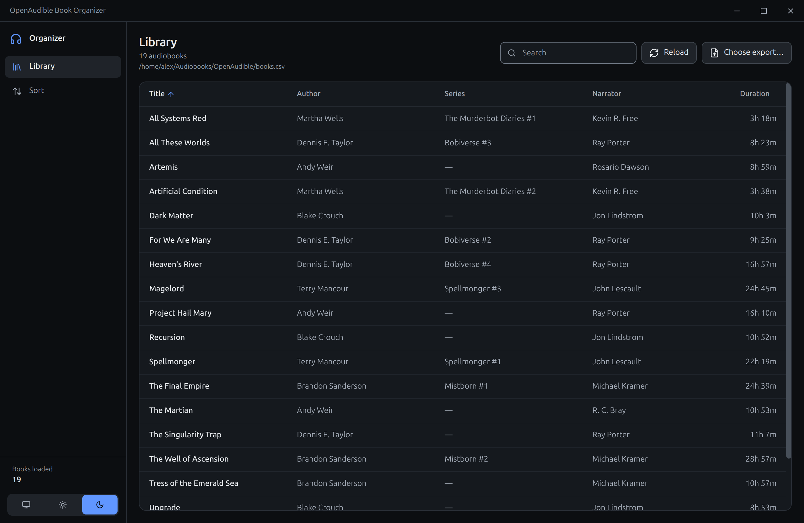
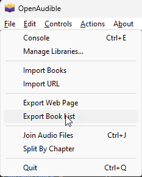
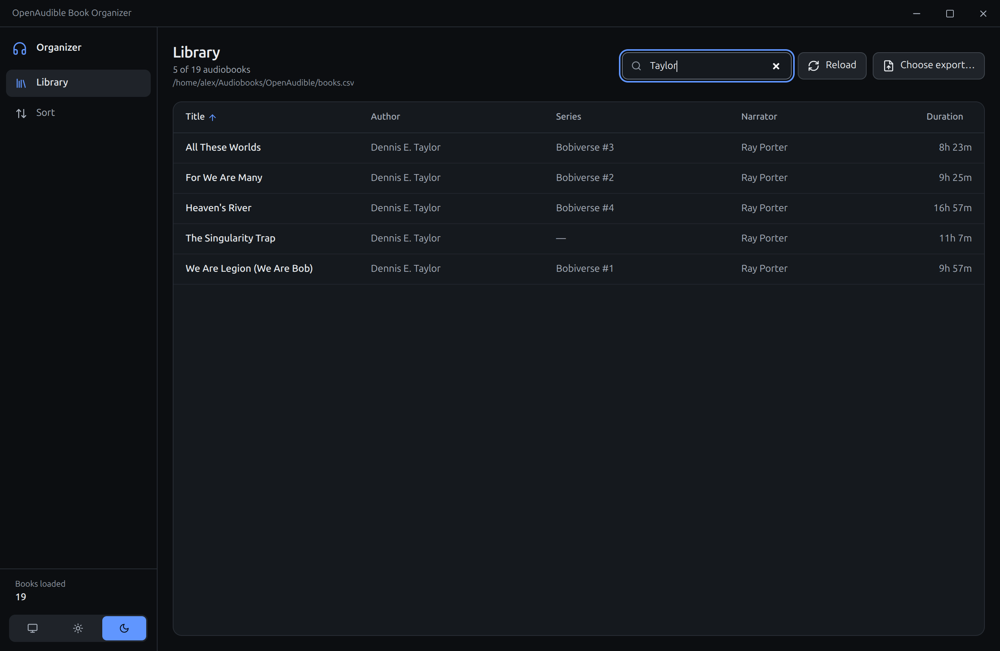
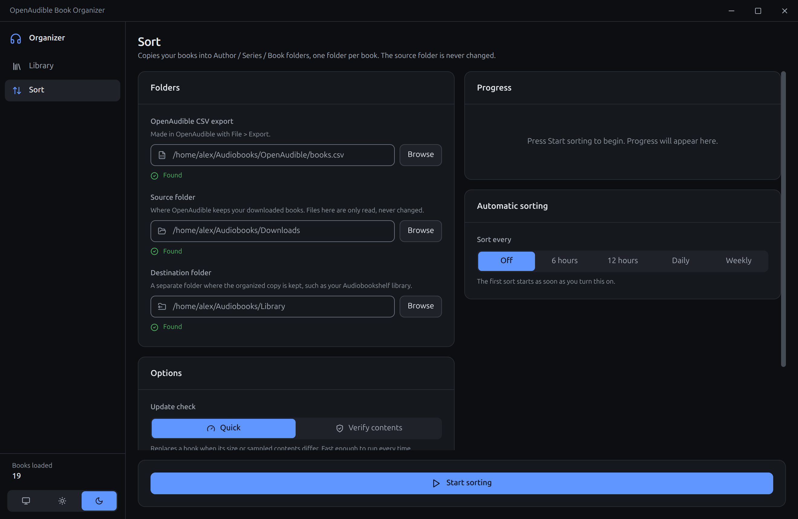
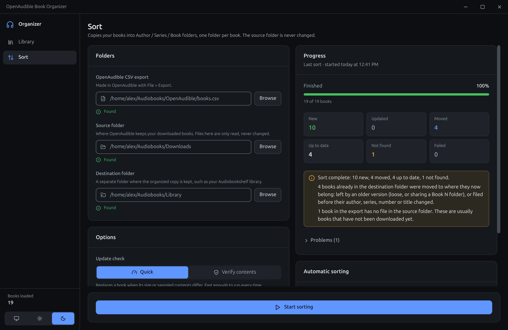

# OpenAudible Book Organizer

Turn a folder full of downloaded audiobooks into a library you can navigate.

OpenAudible gives you your books, but it leaves them as a flat pile of files with names like
`B08XYZ123.m4b`. This app reads the CSV export from OpenAudible and copies each book into an
`Author / Series / Book` folder structure, keeping the originals untouched.

It runs as a desktop app on **Windows, macOS and Linux**, and as a **Docker** container with a
browser interface for a NAS or home server.



## What it does

- Reads an OpenAudible CSV export and shows your library, searchable and sortable
- Copies each book into its own folder under `Author / Series / Book`, the layout Audiobookshelf and Plex expect
- Brings companion PDFs along with the audiobook
- Replaces books you have re-downloaded, so an organised library stays current
- Can re-sort on a schedule, so new downloads are filed without you lifting a finger — on the
  desktop it can keep doing that from the system tray after you close the window
- Tells you, book by book, which ones it could not find or could not copy, and why
- Never moves or deletes anything in your source folder — it only ever copies out of it

---

# Using the desktop app

## 1. Install

Download the file for your platform from the
[latest release](https://github.com/orbitalteapot/OpenAudible-BookOrganizer/releases). Nothing else
is required — the app bundles everything it needs, so you do **not** need .NET or Node installed.

| Platform | File | How to install |
| --- | --- | --- |
| Windows | `...-windows-x64.exe` | Run the installer. |
| macOS (Apple Silicon) | `...-macos-arm64.dmg` | Open the disk image, drag the app to Applications. |
| macOS (Intel) | `...-macos-x64.dmg` | Open the disk image, drag the app to Applications. |
| Linux | `...-linux-x86_64.AppImage` | `chmod +x` the file, then run it. |
| Linux (Debian/Ubuntu) | `...-linux-amd64.deb` | `sudo apt install ./<file>.deb` |

### These builds are not code-signed

Signing certificates cost money per platform, so the releases are unsigned. Your operating system
will say so, in language that sounds more alarming than the situation warrants. This is what you
will see and what to do about it:

**Windows** shows *"Windows protected your PC"*. Click **More info**, then **Run anyway**.

**macOS** refuses to open the app, saying Apple cannot check it for malicious software. Either
right-click the app in Applications and choose **Open** (which offers an Open button the normal
double-click does not), or clear the quarantine flag from a terminal:

```sh
xattr -dr com.apple.quarantine "/Applications/OpenAudible Book Organizer.app"
```

**Linux** has no such prompt. For the AppImage, just make it executable:

```sh
chmod +x OpenAudible-Book-Organizer-*-linux-x86_64.AppImage
./OpenAudible-Book-Organizer-*-linux-x86_64.AppImage
```

If you would rather not run unsigned binaries, [build from source](#building-from-source) — it is
two commands.

## 2. Export your library from OpenAudible

In OpenAudible, export your book list to CSV. This file is what tells the organiser which file is
which book.



Re-export whenever you buy or download more books. Saving over the same file is easiest: the app
remembers where it is.

## 3. Load your library

Open the app, stay on the **Library** page and click **Choose export…**. Pick the CSV you just
exported.

Your books appear in a table you can search and sort. Click any column heading to sort by it;
click again to reverse it. Sorting by **Series** orders books within each series by their number,
so a series reads in order rather than alphabetically.



The app remembers the export, so from then on the library loads by itself when you open the app.
After re-exporting, click **Reload** to read the file again; **Choose export…** switches to a
different file. The Library and Sort pages always use the same export.

If some rows of the export could not be read, a note above the table says how many were skipped;
open it to see which rows and why.

Loading the CSV only reads it. Nothing is copied until you say so.

## 4. Sort your books

Go to the **Sort** page. The **Folders** card holds three paths; click **Browse** next to each:

| Field | What to choose |
| --- | --- |
| **OpenAudible CSV export** | The CSV file from step 2 — already filled in if you chose it on the Library page. |
| **Source folder** | Where OpenAudible put your downloaded books. |
| **Destination folder** | Where you want the organised library. Must not be inside the source folder. |



Each path is saved as soon as you pick it, so you only do this once. Under each one the app says
whether it can see it: **Found**, **Not found** or **Not set**. A path the app refuses — a
destination inside the source folder, say — is explained right there, and the row keeps the path
that was saved before.

The **Options** card has two settings, both remembered between runs:

| Option | Choices |
| --- | --- |
| **Update check** | **Quick** or **Verify contents** — how closely a book is compared with the copy already at the destination. See [Keeping books up to date](#keeping-books-up-to-date). |
| **Copy speed** | **Normal** copies several books at once. **Gentle** copies one book at a time: use it for network drives and USB disks, which get slower, not faster, when several copies compete. |

**How books are organised**, folded away under the options, shows the folder layout the sort will
produce.

Then click **Start sorting**, at the bottom of the page. If the button is greyed out, the line
underneath says why — usually a path that has not been chosen yet.

If the destination folder does not exist, the app asks before doing anything: *"The destination
folder doesn't exist. Is the drive connected?"* The likeliest reason is an external drive or a
network share that is not plugged in, and sorting onto your internal disk instead would quietly
fill it. Connect the drive and start again, or click **Create folder and sort** if a new folder is
what you want.

Progress appears in the **Progress** card as it works, with the book that finished last. It first
says *Getting ready* while it reads the export and looks through the folders, which on a large
library on a network drive can take a few minutes. You can cancel at any point — books already
copied are complete files, and re-running picks up where you left off. A small **Sorting…** badge in the sidebar shows the progress from any page; click it
to go straight to the Progress card.



Every book lands in exactly one of six counters, so they add up to the books processed:

| Counter | Meaning |
| --- | --- |
| **New** | Not in your library yet; copied in. |
| **Updated** | Replaced an out-of-date copy at the destination. |
| **Moved** | Already in the destination but not where it now belongs — left loose by an older version of this app, or filed before its series details changed — and moved there (see [below](#how-your-books-get-organised)). |
| **Up to date** | Already at the destination and unchanged, so nothing was written. |
| **Not found** | Listed in the export, but no audio file for it in the source folder — usually books you have not downloaded. A PDF on its own is not copied; it comes along once the audio is there. |
| **Failed** | Could not be copied. The problems list says why. |

When anything needs your attention, a **Problems** list appears under the counters. Open it to see
each book by title, grouped into *Could not be copied*, *No file in the source folder* and
*Warnings*, with the reason in plain words — a full disk, a folder you do not have permission to
write to, a file another program has open. Up to 500 books are listed; beyond that it says how many
more there were.

Running a sort again after adding books is cheap: everything already in place is up to date and
left alone.

## Keeping books up to date

Publishers re-issue audiobooks — a corrected chapter, a re-recorded narration, a new edition. When
you download the new version, a sort should replace the copy in your organised library rather than
leave the old one sitting there.

Every run compares each book against the copy at the destination and only writes when they differ.
How closely it compares is up to you, using the **Update check** setting on the Sort page:

| Update check | What it compares | When to use it |
| --- | --- | --- |
| **Quick** (default) | File size, plus the first, middle and last 4 KB | Every day. It catches any re-release whose length changed, which is nearly all of them, and costs almost nothing over a large library. |
| **Verify contents** | Every byte of both files | When you suspect a book was re-issued at exactly the same size, or you want certainty after a bad disk or an interrupted copy. Slower: it reads both files in full. |

Two things worth knowing about re-releases:

- **Nothing is ever deleted from your destination folder.** If a re-release changes a book's title
  enough to be filed under a different name, the new file is written alongside the old one and
  removing the old copy is up to you. A title differing only in punctuation or spacing still
  resolves to the existing file and is replaced in place.
- **Replacing a book is atomic.** The new version is written beside the old one and renamed over
  it, so an interrupted update leaves you with either the old copy or the new one, never half of
  each.

## How your books get organised

```text
Terry Mancour/
  Spellmonger/
    Book 1/
      Spellmonger.m4b
      Spellmonger.pdf
    Book 2/
      Warmage.m4b
  The Wolf Queen/
    The Wolf Queen.m4b
Andy Weir/
  Project Hail Mary/
    Project Hail Mary.m4b
```

Every book gets a folder of its own: a numbered series book goes in `Book N`, and any other book in
a folder named after its title. Two books with the same number (two narrations of one book, say)
get `Book 1` and `Book 1 (2)`, in the order of the export. That is the layout Audiobookshelf, Plex and similar servers expect —
a loose audio file in an author folder makes them treat that whole folder as one book and miss every
series inside it. A companion PDF is copied next to its audiobook when the export mentions one and
the file is present.

Libraries sorted by an older version, which left standalone books loose in the author folder, are
tidied up on the next sort: each loose file is moved into its new book folder rather than copied a
second time, and counted as **Moved**. The same happens to a book whose metadata has changed shape
since it was filed — one that has since been given a series, or a number within its series — so it
is not left behind as a second copy. This always happens: a loose file next to a book folder is
exactly what breaks Audiobookshelf. Only a file that holds the same audio as the book in the source
folder is moved, and only within the destination folder. A file with the book's old name but
different audio may be the only copy of another book with the same title (one you have returned, or
not downloaded again), so it is left where it is and the problems list names it: delete it yourself
if it is an old copy of that book.

Names come from your metadata, cleaned up so the result is portable:

- Characters that are illegal in Windows file names (`: ? * " < > | \ /`) are removed on every
  platform, so the library can be moved to a NAS or an external drive without breaking.
- Very long names are shortened to 200 characters.
- Two spellings of the same author (`J.K. Rowling` and `JK Rowling`) resolve to one folder, and an
  existing folder that means the same thing is reused rather than duplicated.
- If two different books would end up with the same file name, the second gets a `(2)` suffix
  instead of overwriting the first.

## Sorting automatically

Pick an interval under **Automatic sorting** on the Sort page — every 6 or 12 hours, daily or
weekly — and the organiser re-sorts on its own, with the folders and options shown above it. The
first sort starts as soon as you turn it on, and the card says so. Only new and changed books are
copied, so a run over an unchanged library takes seconds.

The card shows when the next sort is due and how the last one went, in the same words as a sort you
start yourself. An automatic sort shows up in the Progress card while it runs, with its progress,
its problems list and a Cancel button, just like one you started.

Automatic sorts never create a missing destination folder. If the drive is not connected, or the
folder cannot be written to, the card says *"Retrying at …"* with the reason, and the sort is tried
again 15 minutes later until it works. If the schedule cannot run at all — the export has gone
missing, say — the card says *"Automatic sorting can't run"* and why.

### Keeping it running on the desktop

By default, automatic sorts run while the app is open; if one was due while it was closed, it runs
as soon as you open the app again. Two switches appear on the card once automatic sorting is on:

- **Keep running in the background when the window is closed.** Closing the window leaves the app
  running in the system tray (the menu bar on macOS), still sorting on schedule. The first time, a
  notification says so. Click the tray icon, or choose **Open Book Organizer** from its menu, to
  bring the window back; choose **Quit** there to stop the app.
- **Start when I sign in.** The app starts with your computer, hidden in the tray, ready for the
  next sort.

Both are off until you turn them on.

If you close the window while a sort is running and background mode is off, the app asks first:
**Keep running in the background** (it finishes, then waits in the tray), **Stop sorting and quit**,
or **Cancel**. Choosing **Quit** from the tray during a sort asks the same question. Stopping a sort this way is as safe as
pressing Cancel.

For sorting around the clock on a machine that is always on, run the
[Docker image](#docker-web-app) and set `SORT_INTERVAL`.

## Appearance

The switch at the bottom of the sidebar picks **System**, **Light** or **Dark**. System follows your
operating system's setting and changes with it.

## If something goes wrong

| Symptom | Likely cause |
| --- | --- |
| Books show as **Not found** and nothing is copied | The source folder does not contain the files named in the CSV. Check the source path, and re-export the CSV if you have moved files since. |
| Books show as **Failed** | Open **Problems** under the counters: each book is listed with the reason, such as a full disk or a folder you cannot write to. |
| *"The destination folder doesn't exist. Is the drive connected?"* | The drive or network share holding your library is not connected. Connect it and start again. |
| The destination says **Can't write to this folder** | You do not have permission to write there, or the drive is read-only. Pick another folder, or fix the permissions. |
| **Start sorting** is greyed out: *"A sort is already running."* | A sort — possibly an automatic one — is still going. Follow it in the Progress card, or cancel it there. |
| **Automatic sorting** is greyed out | Choose all three paths first; the card says which are missing. |
| *"The Book Organizer backend could not be started"* | The part of the app that does the copying did not start. The message says why; restart the app, and reinstall it if that keeps happening. |
| No tray icon on Linux | Some desktops, including GNOME, only show tray icons with an extension such as *AppIndicator and KStatusNotifierItem Support*. Without one, leave background mode off. |
| Some books land under **Unknown** | Those rows have no author in the CSV. Fix them in OpenAudible and re-export. |
| A row is missing from the library | The CSV row could not be read. The Library page says how many rows it skipped, and why, above the table. |

---

# Docker (web app)

The container runs the same organiser with a browser interface instead of a desktop window, which
suits a NAS or home server. Unlike the desktop app, its paths are fixed by the container's
environment rather than chosen in the browser — the web page is a control panel for the container.
The Sort page shows each path with whether the container can see it, and tells you which variable
to change when it cannot.

## The image

```text
ghcr.io/orbitalteapot/openaudible-bookorganizer
```

Note there is **no hyphen** between "book" and "organizer" in the image name.

```sh
docker pull ghcr.io/orbitalteapot/openaudible-bookorganizer:latest
```

Tags published by the release workflow:

| Tag | Points at |
| --- | --- |
| `latest` | The most recent stable release. |
| `3.1` | The most recent `3.1.x` stable release. |
| `3.1.0` | That exact release, forever. |
| `3.1.0-beta.1` | A pre-release, under its exact version **only**. |

A pre-release never becomes `latest` or the major/minor tag, so pulling `latest` cannot land you on
a beta by accident — you have to ask for it by name.

## Run it

You need three directories on the host: one holding your CSV export, your source audiobooks, and
the destination for the organised library.

```sh
docker run -d \
  --name openaudible-bookorganizer \
  -e CSV_PATH=/data/books.csv \
  -e SOURCE_PATH=/source \
  -e DESTINATION_PATH=/destination \
  -e SORT_INTERVAL=6h \
  -p 5123:5123 \
  -v ./data:/data \
  -v /path/to/your/audiobooks:/source \
  -v /path/to/your/organized:/destination \
  --restart unless-stopped \
  ghcr.io/orbitalteapot/openaudible-bookorganizer:latest
```

Or with Docker Compose:

```yaml
services:
  book-organizer-web:
    image: ghcr.io/orbitalteapot/openaudible-bookorganizer:latest
    environment:
      CSV_PATH: /data/books.csv
      SOURCE_PATH: /source
      DESTINATION_PATH: /destination
      SORT_INTERVAL: 6h
    ports:
      - "5123:5123"
    volumes:
      - ./data:/data
      - /path/to/your/audiobooks:/source
      - /path/to/your/organized:/destination
    restart: unless-stopped
```

```sh
docker compose up -d
```

The [docker-compose.yml](docker-compose.yml) in this repository is the same service, built from
source rather than pulled, with every setting explained in its comments.

The container runs as root unless told otherwise, so every folder and file it sorts belongs to root
on the host, and cannot be renamed or deleted over SMB or by another app running as you. To have
them owned by you, run it as your own user and group ids (`id` on the host prints them): add
`--user 1000:1000` to `docker run`, or `user: "1000:1000"` to the service in Compose. That user
must be able to read the source folder and write the destination and data folders.

Then open <http://localhost:5123>. The library loads by itself, and the Sort page works as it does
on the desktop, minus the file pickers and the tray. The update check, copy speed and automatic
sorting chosen there are saved in the mounted data folder (`/data/settings.json`), so they survive
a restart or an image update.

## Configuration

| Variable | Required | Default | Purpose |
| --- | --- | --- | --- |
| `CSV_PATH` | yes | — | The OpenAudible CSV export, inside the container. |
| `SOURCE_PATH` | yes | — | Mounted folder holding your downloaded audiobooks. |
| `DESTINATION_PATH` | yes | — | Mounted folder to write the organised library into. It must already exist: automatic sorts never create it, so an unmounted drive is reported rather than filled in. |
| `COMPARISON_MODE` | no | `quick` | Update check used until one is chosen on the Sort page: `quick` or `full`. Once chosen there, the page's choice is saved and wins. |
| `SORT_INTERVAL` | no | off | Sort automatically, e.g. `6h`, `12h`, `1d` or `30m` (at least 15 minutes; a bare number is hours). A valid value fixes the schedule, and the Sort page shows it without letting it be changed. Leave it unset, or set `off`, to choose automatic sorting on the Sort page instead. A value that cannot be read is ignored, and the Sort page says so. |
| `OABO_MAX_PARALLELISM` | no | cores ÷ 4, max 8 | How many books are copied at once at the **Normal** copy speed. The Sort page's **Gentle** copy speed always copies one at a time, which is the better choice for a network share or a spinning disk. |
| `OABO_SETTINGS_PATH` | no | `/data/settings.json` | Where the choices made on the Sort page, and the history of automatic sorts, are saved. |
| `ASPNETCORE_URLS` | no | `http://0.0.0.0:5123` | Change the port the container listens on. |

Setting any of the three paths fixes all three: the container mounts its volumes where its
variables say, and a path chosen in the browser would point somewhere the container cannot see.

## Updating your library

Replace `books.csv` in the mounted data folder with a fresh export, click **Reload** on the Library
page, then start a sort. With automatic sorting on — from `SORT_INTERVAL` or chosen on the Sort
page — the next automatic sort picks the new export up by itself: point OpenAudible's export at that
file and there is nothing left to do by hand.

## Checking it works

```sh
docker ps                                    # container is running
curl http://localhost:5123/api/health        # {"status":"ok"}
docker logs -f openaudible-bookorganizer     # startup, configured paths, sort results
```

The first lines of the log show what the container resolved: the address it listens on, each of
the three paths with whether it was found or is missing, the update check and copy speed, whether
the schedule comes from `SORT_INTERVAL` or the Sort page, and any variable that was ignored. That is
the quickest way to spot a mount that is not where you thought it was. After that, every sort logs
one line with its outcome, such as `Scheduled sort finished: 3 new, 120 up to date.`

The same information is in the app, so you rarely need the log: each path's status on the Sort
page, the problems list for every run, and any ignored setting as a warning at the top of every page.

## Docker troubleshooting

| Symptom | Likely cause |
| --- | --- |
| Page does not load | Port `5123` is not published, or is taken on the host. |
| A path says *"not found inside the container"* | The volume for it is missing from `docker-compose.yml` or the `docker run` command, or the variable does not match where it is mounted. The startup log lists what the container sees. |
| Everything is **Not found** | `SOURCE_PATH` is mounted somewhere other than where the books are. |
| *"The destination folder cannot be the source folder or a folder inside it."* | Copying a folder into itself never terminates cleanly, so it is refused. Mount them separately. |
| *"The destination folder … was not found inside the container"* | The volume behind `DESTINATION_PATH` is not mounted, or the host folder is missing. The container never creates it, so a forgotten mount cannot fill the container with a copy of your library. Automatic sorts retry every 15 minutes until it is back. |
| *"The folder … does not exist inside /destination"* | The mount works, but the subfolder `DESTINATION_PATH` names (such as `/destination/Audiobooks`) has not been made yet. Create it on the host, in the folder mapped to `/destination`. |
| *"Cannot write to the destination folder"* | The container's user cannot write to the mounted folder. Check the host folder's permissions. |
| Sorted books cannot be renamed or deleted over SMB or by another app | The container ran as root, so it owns what it sorted. Run it as your own user (see above) and, once, `chown -R` the destination folder on the host back to you. |
| A warning at the top of the page, such as ``SORT_INTERVAL="6x" was ignored`` | The value could not be read. Use something like `6h`, `12h` or `1d`, or `off`. |
| A warning at the top of the page: *"The settings could not be saved…"* | The `./data` folder is mounted read-only, or its disk is full. The Sort page's choices and when automatic sorting last ran are forgotten on every restart until `settings.json` can be written. |
| A warning at the top of the page: *"The saved settings could not be read…"* | `settings.json` was not valid JSON (a hand edit, say). The container started with the default settings and kept the old file beside it as `settings.json.unreadable-<date>`, so nothing in it is lost. |
| `docker pull` fails | Check the image name has no hyphen between "book" and "organizer", and that you are logged in to GHCR if the package is private. |

The image is published to GitHub Packages, not attached to release assets:
`https://github.com/users/orbitalteapot/packages/container/package/openaudible-bookorganizer`

---

# Building from source

### Prerequisites

- [.NET 10 SDK](https://dotnet.microsoft.com/download/dotnet/10.0)
- [Node.js](https://nodejs.org/) 20 or newer

### Run in development

```sh
cd electron-ui
npm install
npm run dev
```

This starts the Vite dev server and the Electron window, and Electron starts the C# backend itself
(`dotnet run`) on a free port, just as the installed app does.

To run the backend yourself instead — under a debugger, say — start it first and point the app at
it with `OABO_BACKEND_URL`:

```sh
# Terminal 1 — the C# backend, on http://127.0.0.1:5123
dotnet run --project ManagerApi

# Terminal 2 — the Electron app, using that backend
cd electron-ui
OABO_BACKEND_URL=http://127.0.0.1:5123 npm run dev
```

A backend started by hand keeps its settings in memory unless `OABO_SETTINGS_PATH` names a file,
and takes the same environment variables as the [Docker image](#configuration). The backend the
app starts itself ignores those (`CSV_PATH`, `SOURCE_PATH`, `DESTINATION_PATH`, `SORT_INTERVAL`,
`COMPARISON_MODE`, `OABO_MAX_PARALLELISM`), so a variable of the same name set for something else
cannot lock the desktop app's folders. With it running,
<http://localhost:5173> in a browser shows the web version of the interface.

### Run the tests

```sh
dotnet test OpenAudibleBookManager.sln     # sorting engine and backend
npm --prefix electron-ui test              # interface
```

The backend suite covers path sanitisation, author and series folder resolution, planning
determinism, finding and moving books left by older versions, atomic and repeatable copying, both
update checks, cancellation, CSV import robustness, path validation, the saved settings, the
schedule's timing and retries, and the HTTP endpoints. The frontend suite covers searching and the
ordering rules behind each column, how a run is put into words, saving settings, following a
running sort, and the Library, Sort and Automatic sorting screens.

### Build installers

```sh
cd electron-ui
npm run dist:win        # Windows NSIS installer
npm run dist:linux      # Linux AppImage + deb
npm run dist:mac-x64    # macOS Intel dmg
npm run dist:mac-arm    # macOS Apple Silicon dmg
```

Output lands in `electron-ui/release/`. Each build publishes the backend as a self-contained
binary first, which is why the installers are large and why users need no runtime installed.

### How it fits together

| Project | Role |
| --- | --- |
| `AudioFileSorter` | The organiser: reads the CSV, decides where every book goes, copies it there. |
| `ManagerApi` | ASP.NET Core host exposing that over HTTP, keeping the settings and the schedule, and serving the web UI in Docker. |
| `electron-ui` | React interface, running either in an Electron window or in a browser. |

The desktop app is the same web interface in an Electron window, with native file pickers and the
tray wired in. Electron starts the backend as a child process listening only on `127.0.0.1`, on a
free port it picks at launch, with its settings in the app's user data folder; the backend is the
one place that knows the settings and whether a sort is running, so the window, the tray and the
schedule always agree.
